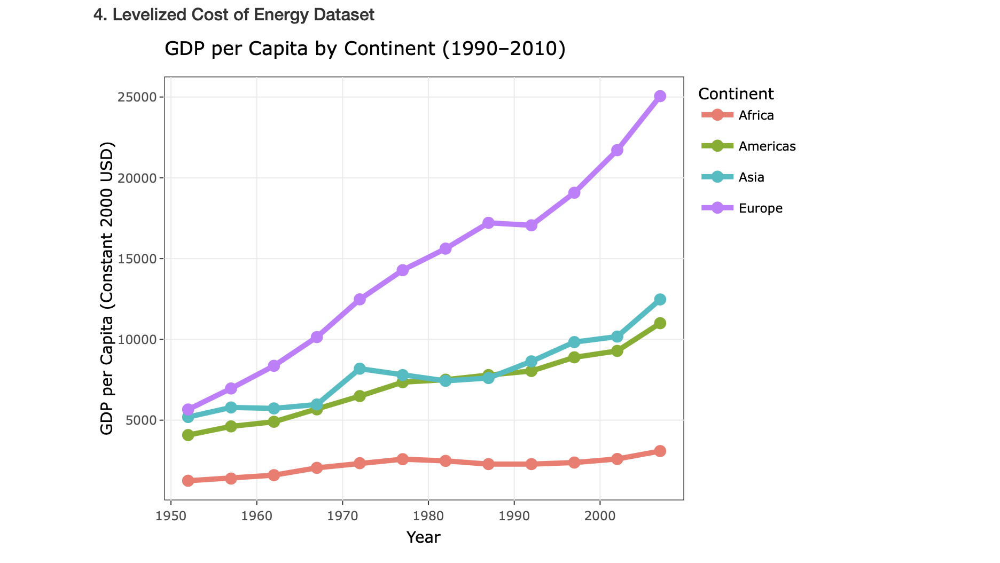

As the world races to decarbonize, not all countries are keeping pace. 
This data story explores global renewable energy adoption, GDP relationships, 
and the stark divide between developed and developing nations. From solar 
surges in Europe to stalled transitions in Sub-Saharan Africa, the patterns 
are surprising and urgent.

[View the full data story](https://joeamasterson.github.io/data_story_1) 
([GitHub repo](https://github.com/joeamasterson/data_story_1))

*GDP per capita (constant 2000 USD) by continent from 1950 to 2010. Europe far outpaces other regions, reaching over $25,000 by 2010, while Africa remains nearly flat. Data from the Levelized Cost of Energy Dataset. Chart by Joe Masterson.*
---
