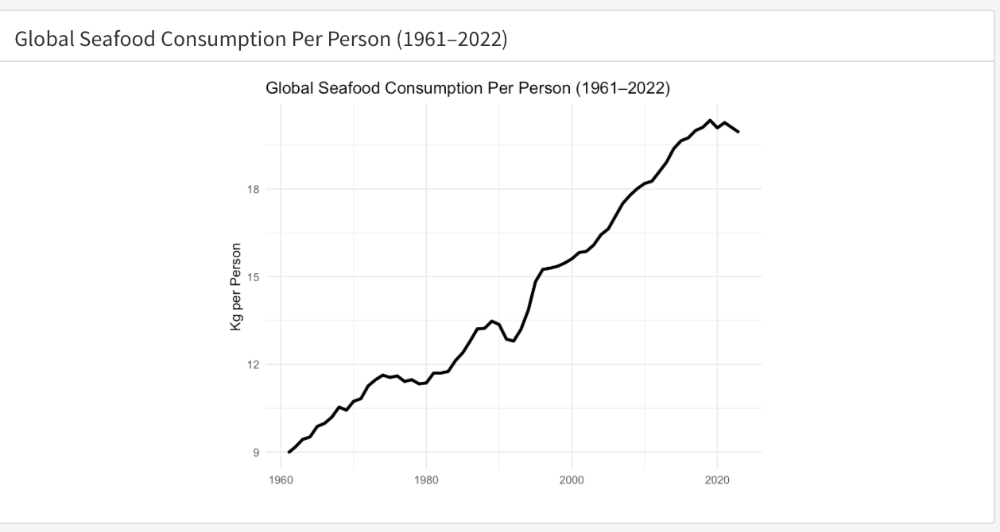

As the world's appetite for seafood grows, so does the pressure on our oceans. 
Sustainable Development Goal 14 calls for the conservation and sustainable use 
of marine resources but can that vision survive a booming global fish market? 
This data story dives into the data on seafood consumption trends, fish stock 
depletion, and aquaculture growth to ask a urgent question: are we fishing our 
way to a crisis?

[View the full data story](https://joeamasterson.github.io/data_story_2/#trends) 
([GitHub repo](https://github.com/joeamasterson/data_story_2))

*Global seafood consumption per person has more than doubled since 1960, rising 
from roughly 9 kg to over 20 kg per person by 2020 — raising serious questions 
about the long-term sustainability of marine ecosystems. Data from the FAO. 
Chart by Joe Masterson.*
---
