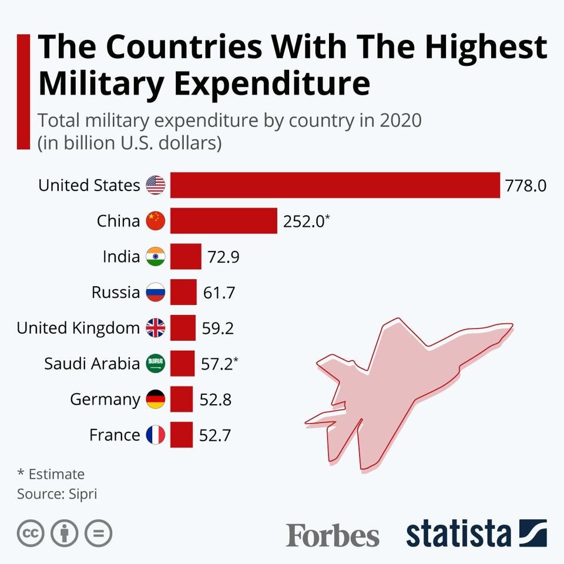

## Why These Goals Matter

The United Nations established the Sustainable Development Goals to address 
some of the world's most pressing challenges — inequality, instability, and 
lack of economic opportunity. Among the 17 goals, **SDG 8** and **SDG 16** 
stand out as uniquely interconnected: one focuses on economic growth and decent 
work, the other on justice, accountable institutions, and peaceful societies.

Together, they raise a critical question: **can a country truly grow its economy 
and strengthen its institutions while simultaneously pouring resources into 
military spending?** The data suggests the answer is complicated.

## A Glimpse at the Data

**Source: Forbes/Statista — [The Countries With The Highest Military Expenditure in 2020](https://www.forbes.com/sites/niallmccarthy/2021/04/28/the-countries-with-the-highest-military-expenditure-in-2020-infographic/)**

## Explore the Data Story

[View the full data story on GitHub Pages](https://joeamasterson.github.io/data_story_3/)
([GitHub Repo](https://github.com/joeamasterson/data_story_3))

## Key Takeaways

- Military spending crowds out investment in education, infrastructure, and jobs
- High defense budgets often correlate with weaker institutional stability
- The trade-off between national security and sustainable development is real
---
