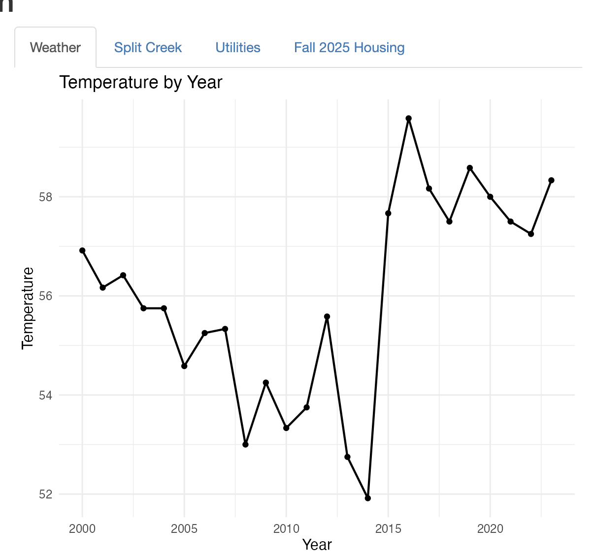

## Why Did we Use Sewanee

Using real datasets on Sewanee's historical weather, Split Creek humidity readings, building-level water consumption, and Fall 2025 housing data, I built an interactive dashboard that lets you explore how this small mountain campus uses and is shaped byits natural environment.

## What's Inside

**Weather Trends (1895–2025):** Over 130 years of temperature and rainfall data reveal how Sewanee's climate has shifted. The average temperatures and precipitation patterns tell a story that goes far beyond any single season.

**Split Creek Humidity:** Sewanee's proximity to the Cumberland Plateau gives it a uniquely wet microclimate. The Split Creek weather station data tracks how local humidity tracks with broader rainfall trends year over year.

**Building Water Use:** Not all dorms are created equal. Some buildings on campus consume dramatically more water per person than others — and the presence or absence of air conditioning turns out to be a surprisingly important factor. Which buildings are the biggest water users? The answer might surprise you.

**Fall 2025 Housing:** A close look at water consumption across residential buildings during the Fall 2025 semester, broken down by capacity, gender distribution, and daily usage — revealing patterns in how students actually use resources.

## Explore the Dashboard

[View the interactive Shiny app](https://github.com/joeamasterson/Data_story_4) ([GitHub Repo](https://github.com/joeamasterson/Data_story_4))

------------------------------------------------------------------------
