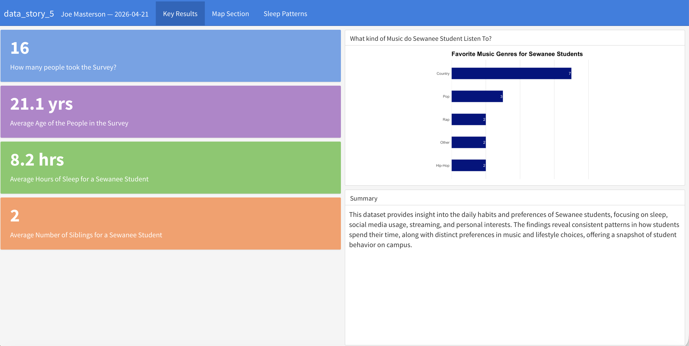

**## What Do Sewanee Students Actually Do With Their Time?** 
  Every college campus has its own culture and Sewanee is no exception. Tucked away on the Cumberland Plateau, life here looks a little different than at most universities. But how different, really? In this data story, I surveyed fellow Sewanee students to find out: How much are we sleeping? How much are we streaming? What music are we listening to? And if we could go anywhere in the world, where would we go? The results paint a surprisingly vivid portrait of student life on the Domain.

## Explore the Full Dashboard

 [View the interactive dashboard](https://joeamasterson.github.io/Data-Story-5-/)
([GitHub Repo](https://github.com/joeamasterson/Data-Story-5-))

**Sewanee student habits survey dashboard.**

*Data collected via student survey, Spring 2026. Dashboard built with R, 
flexdashboard, plotly, and leaflet.*